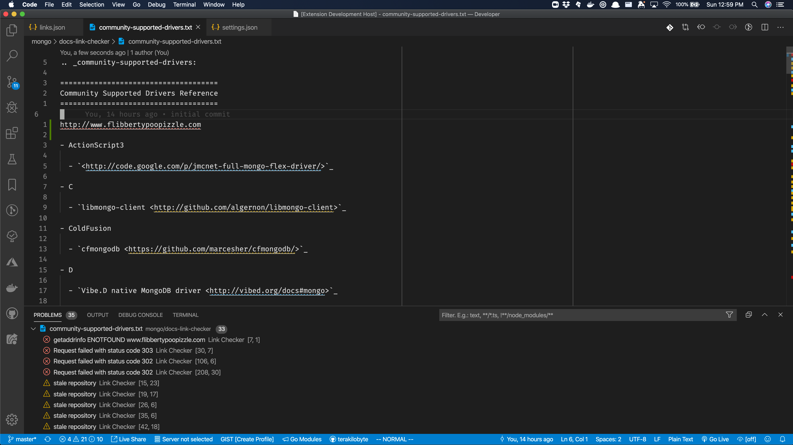

# link-checker

This extension checks links in `.md`, `.txt`, and `.rst` files for their
status and for repository freshness.

## Features

Automatically check links for their response code, and in the case of Github repositories, their freshness. Created for authoring docs at MongoDB, it will
also check links in `:roles:` using the latest **release**.



## Requirements

This extension requires a [Github Developer API Key](https://github.com/settings/tokens).
Once you have an API key with full **repos** permissions,
define an environmental variable called `LINK_CHECKER_TOKEN`.

For example, if you use `zsh`:

```sh
echo "LINK_CHECKER_TOKEN=<API Key>" >> ~/.zshrc
```

## Extension Settings

## Known Issues

## Release Notes

### 1.0.0

Initial release of Link Checker.

### 1.1.1

* Now only checks links that begin with http:// and https://
* Checked links are now tracked and won't be rechecked every save.

### 1.2.0

* Now consults `rstspec.toml` for role resolution and validates links using `:roles:`.
  It pulls role information from the latest **release**.
* Roles resolved with an extra slash will be reported in warnings.

**Enjoy!**
